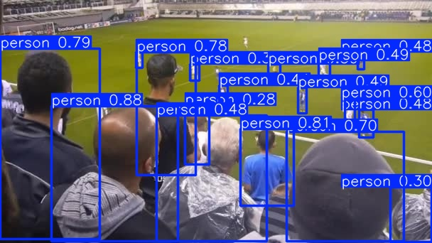
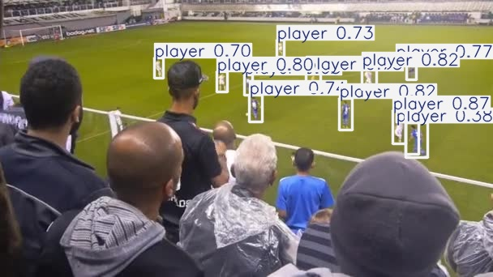

# Training YOLOv11 with Custom Data

## Overview
This README provides comprehensive instructions for training YOLOv11 on custom datasets. YOLOv11 builds upon previous YOLO architectures with improved accuracy and speed, making it ideal for both real-time and high-precision object detection tasks.

## Platform:
- Python 3.8+
- ultralytics, roboflow
- I use Google Colab and Kaggle to train model
- GPU T4 on Google Colab and GPU T4 $\times 2$ on Kaggle

## Prerequisites
```python
pip install ultralytics
pip install roboflow
```
and other neccessary libraries

## Data:
- images

## How to label for dataset:
I use Roboflow to label with 4 classes: 
```
nc: 4
names: ['ball', 'goalkeeper', 'player', 'referee']
```
## Preparing Your Custom Dataset

### Data Structure
Organize your dataset in the YOLO format:
```
dataset/
├── train/
│   ├── images/
│   │   ├── img1.jpg
│   │   ├── img2.jpg
│   │   └── ...
│   └── labels/
│       ├── img1.txt
│       ├── img2.txt
│       └── ...
├── test/
│   ├── images/
│   │   └── ...
│   └── labels/
│       └── ...
├── val/
│   ├── images/
│   │   └── ...
│   └── labels/
│       └── ...
└── data.yaml
```

### Label Format
Each `.txt` label file should contain one row per object in the corresponding image:
```
class_id x_center y_center width height
```
Where:
- `class_id`: Integer class identifier (0-indexed)
- `x_center, y_center, width, height`: Normalized values between 0-1

### YAML Configuration
Create a `data.yaml` file with your dataset configuration:

```yaml
# Dataset paths
path: /path/to/dataset  # Root directory
train: train/images     # Train images (relative to path)
val: val/images         # Validation images (relative to path)
test: test/images       # Test images (relative to path)

nc: count classes in your dataset
names:
  0: class1
  1: class2
  # Add all your classes
```

> You can fork my dataset for reference using the provided link: [LINK](https://universe.roboflow.com/industrial-university-of-ho-chi-minh-city-inppl/football-players-detection-3zvbc-awjwy/dataset/1)

## Training

**Please you see more in my 2 notebooks. I use CLI in `train_yolo11_with_custom_data_cli_google_colab.ipynb` and Python code in `train-yolo11-with-custom-data-python_kaggle.ipynb`**

## Results:

### **Original model:**

image:

<p align="center"></p>

video:

<p align="center"></p>

### **Trained model:**

image:

<p align="center"></p>

video:

<p align="center"></p>